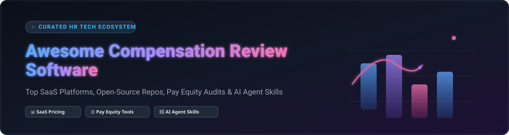

  
  
  
  
  

# 💼 Awesome Compensation Review Software

A comprehensive, SEO-curated list of **SaaS Platforms**, **Open-Source Repositories**, **Pay Equity Analysis Tools**, and **AI Agent Skills** for **Compensation Review, Salary Benchmarking, Merit Cycles, & Total Rewards Statements**.

> **Last Updated: September 2026**

---

## 📌 Table of Contents
- [🔍 Overview](#-overview)
- [🏢 SaaS & Hosted Compensation Platforms](#-saas--hosted-compensation-platforms)
- [💻 Open-Source GitHub Repositories](#-open-source-github-repositories)
- [🤝 How to Contribute](#-how-to-contribute)
- [⚠️ Disclaimer](#%EF%B8%8F-disclaimer)
- [📈 Star History](#-star-history)
- [💖 Support & Community](#-support--community)

---

## 🔍 Overview

Compensation review software enables HR leaders, People Operations teams, and compensation analysts to structure base salary bands, benchmark roles against real-time market data, execute merit and bonus cycles, audit pay parity (gender & ethnic pay equity), and deliver dynamic Total Rewards Statements to employees.

Whether you are evaluating enterprise HCM modules, mid-market SaaS platforms, or building custom pay equity pipelines using open-source packages and AI Agent skills, this directory provides a transparent overview of capabilities, pricing tiers, free trial limits, and project maturity.

---

## 🏢 SaaS & Hosted Compensation Platforms

> 📊 **Market Size & Sector Structure:** The global Compensation Management Software market is valued at **$2.4 Billion (2025/2026)** and is projected to reach **$4.8 Billion by 2032** (CAGR ~9.8%). The market is **moderately fragmented**—dominated at the enterprise tier by legacy HCM providers (Oracle, Workday) and compensation survey aggregators (Payscale), while agile, AI-native SaaS platforms (Pave, beqom, OpenComp) lead innovation in real-time benchmarking, automated merit cycles, and pay transparency.

*Note: The table below is sorted descending by company size / valuation.*

| 🚀 Platform | 🏢 Company Size / Valuation | 💰 Starting Pricing | 🎁 Free Tier / Trial Limits | 📋 Core Features |
| :--- | :--- | :--- | :--- | :--- |
| **[Oracle Compensation](https://www.oracle.com/human-capital-management/compensation/)** | **$440.0B Valuation** ($53.8B Revenue) | **$15.00 / employee / month** ($180/emp/yr; ~$15,000 min annual contract) | **30-day free trial** ($300 credits in Oracle Cloud Free Tier; no free-forever plan) | Global workforce compensation, merit budget distribution, total rewards statements, and compliance audits. |
| **[Workday Compensation](https://www.workday.com/en-us/products/human-capital-management/compensation.html)** | **$68.0B Valuation** ($7.2B Revenue) | **$50.00 / user / month** (Enterprise quote starting at ~$30,000/yr min contract) | **0-day free trial** (No free trial available; interactive guided live demo upon request) | HCM-integrated salary bands, global merit planning, bonus administration, and executive compensation reporting. |
| **[Pave](https://www.pave.com/)** | **$1.6B Valuation** ($31.0M ARR) | **$4,000 / year base platform fee** (~$12–$15/employee/year for paid tiers) | **Free Forever plan** (Market Data Lite: 100% free for companies with 1–200 employees for base salary & equity benchmarks) | Real-time market benchmark data, salary band management, automated merit cycle planning, and equity visualizers. |
| **[Payfactors (Payscale)](https://payfactors.com/)** | **$1.0B Valuation** ($150.0M Revenue) | **$5,000 / year starting base subscription** | **0-day free trial** (No free trial available; live demo upon request) | Market pricing engine, compensation survey data aggregation, job matching, and salary structure modeling. |
| **[Salary.com CompAnalyst](https://www.salary.com/products/companalyst/)** | **$600.0M Valuation** ($100.0M Revenue) | **$2,500 / year starting price** (CompAnalyst Small Business tier) | **14-day free trial** (Access to sample benchmark datasets and compensation reporting tools) | Market pricing data, salary structures, merit planning tools, job description management, and pay equity reporting. |
| **[beqom](https://www.beqom.com/)** | **$500.0M Valuation** ($46.0M ARR) | **$50,000 / year** (CHF 50,000/year base starting enterprise tier) | **0-day free trial** (No free trial available; custom proof-of-concept demo upon request) | Enterprise merit cycles, bonus allocation, sales incentive compensation (ICM), pay equity audits, and total rewards. |
| **[OpenComp](https://www.opencomp.com/)** | **$100.0M Valuation** ($12.0M ARR) | **$2,500 / year** ($250/month starting paid plan) | **Free Forever plan** (OpenComp Starter: Free for teams under 50 employees with core market pricing) | Salary range creation, market benchmarks, Total Rewards Statements, merit planning, and pay equity audit tools. |
| **[PerformYard](https://performyard.com/)** | **$100.0M Valuation** ($18.0M ARR) | **$5.00 / employee / month** ($60/emp/yr, $1,000/year annual minimum) | **0-day free trial** (No free trial available; live personalized walkthrough demo) | Performance management platform with integrated compensation review, merit distribution, and manager calibration. |
| **[Celential.ai](https://celential.ai/)** | **$50.0M Valuation** ($10.0M ARR) | **$500 / month** ($6,000/year starting subscription tier) | **7-day free trial** (Full sandbox access to AI candidate pay analytics platform) | AI-driven compensation intelligence, talent market pay analytics, and real-time compensation benchmarking. |
| **[Compport](https://compport.com/)** | **$30.0M Valuation** ($6.0M ARR) | **$3.00 / employee / month** ($36/emp/yr, $1,500/year minimum) | **14-day free trial** (Full sandbox trial for merit planning and pay equity workflows) | Salary benchmarking, merit cycle budget allocation, bonus calculation, pay equity analysis, and total rewards. |

---

## 💻 Open-Source GitHub Repositories

The open-source compensation ecosystem provides modular building blocks—from statistical equal pay R packages to AI Agent skills for salary bands and automated Python pipelines.

*Note: Repositories below are sorted descending by GitHub Stars_Count.*

| 📦 Repository & Project Name | ⭐ GitHub_Stars | 🛠️ Category & Tech Stack | 📝 Description |
| :--- | :--- | :--- | :--- |
| **[jlevy/og-equity-compensation](https://github.com/jlevy/og-equity-compensation)** |  | **Framework / Guide** | **Open Guide to Equity Compensation.** Standard reference framework for stock options, RSUs, startup compensation models, offer evaluation, and tax implications. |
| **[afrexai-compensation-planner](https://github.com/1kalin/afrexai-compensation-planner)** |  | **AI Agent Skill** | **Comprehensive compensation planning framework for AI agents.** Covers base salary bands, equity/bonus frameworks, geographic differentials (cost-of-labor multipliers), and pay equity audit rules. |
| **[sourcegraph/handbook](https://github.com/sourcegraph/handbook)** |  | **Compensation Policy** | **Sourcegraph Open Handbook.** Industry-standard example of transparent compensation strategy, job leveling, location-based pay factors, and total rewards documentation. |
| **[0xku/leetcode-compensation](https://github.com/0xku/leetcode-compensation)** |  | **Python / Dashboard** | **LeetCode Compensation Parser & Dashboard.** Scrapes, normalizes, and visualizes real-time tech offer compensation data (base, equity, sign-on bonus). |
| **[hr-compensation-benefits Skill](https://github.com/tuanductran/hr-skills)** |  | **AI Agent Skill** | **AI Agent Skill for compensation and benefits support.** Performs job evaluations, market pay trend analysis, bonus plan design, and total rewards statements creation. |
| **[SamirSaad786/comp-decoder](https://github.com/SamirSaad786/comp-decoder)** |  | **Web App / React** | **Compensation Offer Decoder.** Translates complex job offers (base salary, vest schedules, equity, sign-on bonuses) into clear total compensation visualizers. |
| **[admin-ebg/logib](https://github.com/admin-ebg/logib)** |  | **R Package / CRAN** | **Switzerland's official equal pay analysis methodology.** Developed by the Federal Office for Gender Equality (FOGE) for statistical gender pay parity auditing. |
| **[kcngkc/FairPay](https://github.com/kcngkc/FairPay)** |  | **Python / Google ADK** | **Autonomous HR compensation benchmarking agent.** Integrates BLS OEWS dataset with Gemini Flash/Pro dual-model strategy to calculate compa-ratios and flag compression. |
| **[alexwems1/PE-Analysis](https://github.com/alexwems1/PE-Analysis/stargazers)** |  | **Python Pipeline** | **Pay Equity Analysis Workflows.** Python data analysis pipeline for evaluating wage gaps, demographic salary distributions, and regression modeling. |
| **[Roxanne_Ardary/gapvision](https://gitlab.com/Roxanne_Ardary/gapvision)** |  | **Python / React / AGPL-3.0** | **Full-Stack Pay Equity Analysis Platform.** Multi-industry compensation tracking, automatic gender pay gap threshold flagging, and career mobility bottleneck detection. |
| **[team-composition-analysis](https://skills.rest/skill/team-composition-analysis-p-o-ke-nae)** |  | **AI Agent Skill** | **Startup Hiring & Comp Planning Skill.** Helps founders structure salary benchmarks, option pool sizing, fully loaded headcount costs, and equity allocation by stage. |
| **[OlgaDimitrovaGit/comp-budget-lab](https://github.com/OlgaDimitrovaGit/comp-budget-lab)** |  | **Web App / JavaScript / Excel** | **Salary review and pay equity cost calculators.** Merit increases by rating and compa-ratio, the review's cost with bonus and employer contributions this year and next, and the gender pay gap before and after the review (EU Directive 2023/970). Runs in the browser with no network requests; each tool comes with a live-formula Excel model of the same calculation. |

---

## 🤝 How to Contribute

We welcome contributions from HR Tech developers, People Ops professionals, and compensation analysts!

1. 🍴 **Fork the Repository**
2. 📝 **Add/Update Entries** in `README.md` following the tabular format.
3. 🔎 **Ensure Data Accuracy**: Include starting price tiers, free trial limits, and exact repository URLs.
4. 📬 **Open a Pull Request** with a concise summary of changes.

---

## ⚠️ Disclaimer

- This directory is a **community-curated list** for informational and research purposes.
- Compensation review systems process sensitive employee salary and equity data. Always adhere to global pay transparency mandates (e.g., EU Pay Transparency Directive, US state salary transparency laws) and data privacy standards (GDPR, SOC 2).
- Commercial platforms (Pave, Workday, beqom) provide fully managed, enterprise-grade merit cycle workflows and market data feeds, while open-source tools provide extensible models for pay equity statistical research and AI agent integration.

---

## 📈 Star History

---

## 💖 Support & Community

Thank you for exploring **Awesome Compensation Review Software**! If you find this curated list helpful for your HR team, compensation strategy, or open-source research, please consider supporting the project:

- ⭐ **Star this repository** to help others discover it.
- 🔀 **Fork & Contribute** by submitting a Pull Request with new SaaS or open-source compensation tools.
- 📢 **Share** with your HR Tech and People Operations networks.
- ☕ **Buy Me a Coffee / Sponsor**: Support ongoing maintenance on the [GitHub Sponsor Dashboard](https://github.com/sponsors/ishandutta2007).
